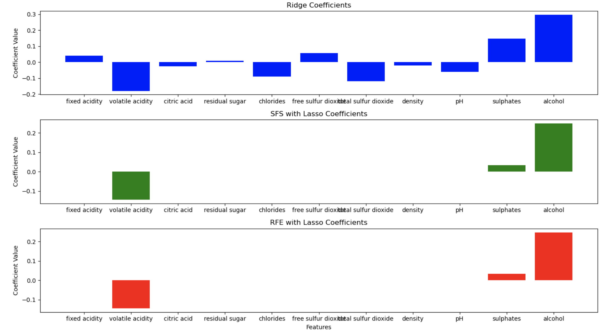
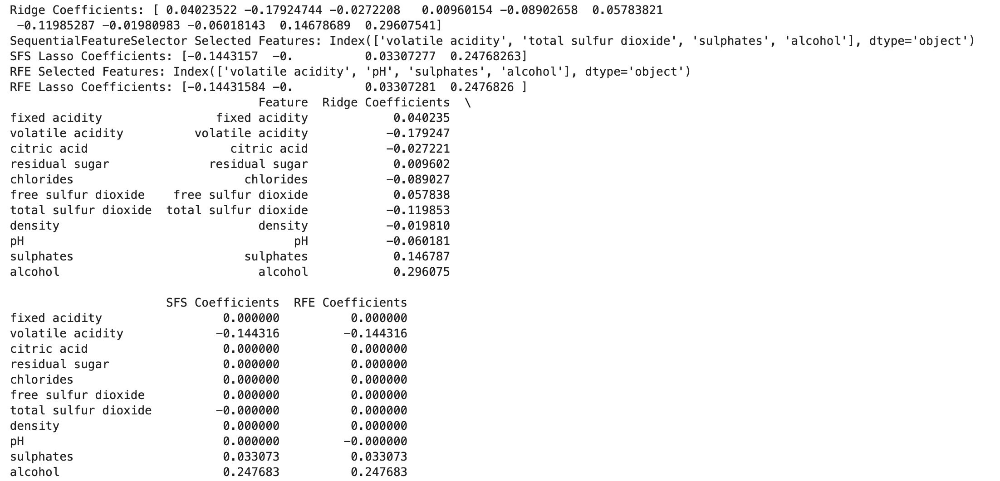

# Goal
We'll conduct Sequential Feature Selection and Recursive Feature Elimination (RFE) to build and compare regression models. 

# Steps 

1.  Load the Data: Load the Wine Quality dataset from the specified file path.
2.  Preprocess the Data: Define features (X) and target (y), split the dataset into training and test sets, and scale the features.
3.  Ridge Regression: Train a Ridge regressor and extract the coefficients.
4.  Sequential Feature Selector (SFS) with Lasso: Select four features using SFS with a Lasso regressor, train a Lasso model using the selected features, and extract the coefficients. R
5.   Recursive Feature Elimination (RFE) with Lasso: Select four features using RFE with a Lasso regressor, train a Lasso model using the selected features, and extract the coefficients.
6. Combine and Display Results: Combine the coefficients from all methods into a DataFrame.
7.   Visualization: Create bar plots to visualize the coefficients from Ridge, SFS with Lasso, and RFE with Lasso.

# Conclusion

In the analysis of the Wine Quality dataset, I applied three feature selection methods: Ridge regression to extract coefficients, Sequential Feature Selector (SFS) with Lasso to select four features, and Recursive Feature Elimination (RFE) with Lasso to select four features. Ridge regression identified the following coefficients for each feature: 

The magnitude of the coefficients from Ridge regression showed the relative importance of features, while SFS and RFE provided a more targeted selection of features that improve the model. Comparing these methods, I found that SFS and RFE with Lasso both effectively reduced the feature space, but SFS was more intuitive in sequentially adding features that improve the model. This analysis highlights the importance of feature selection in improving model performance and interpretability.

